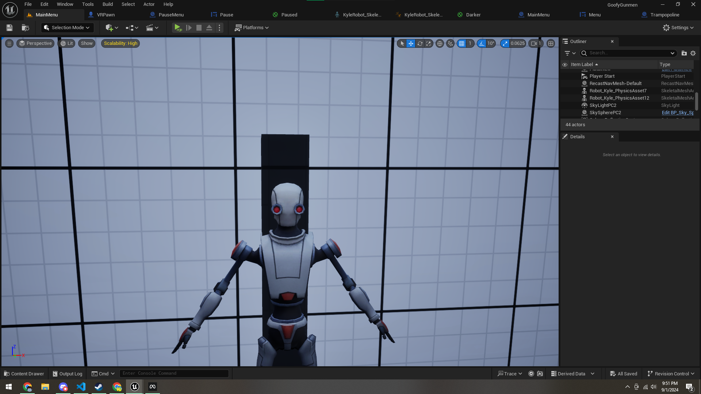
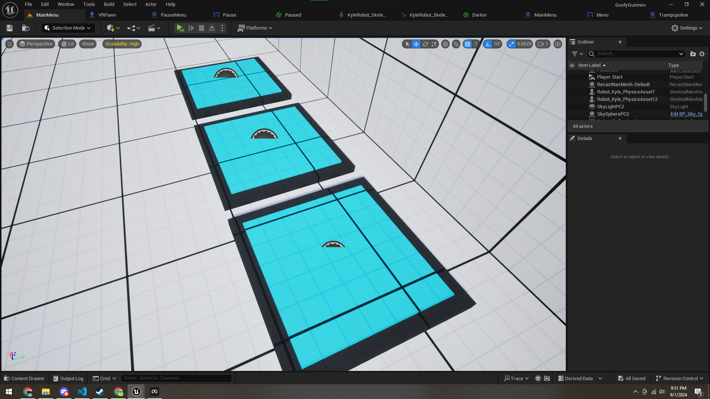
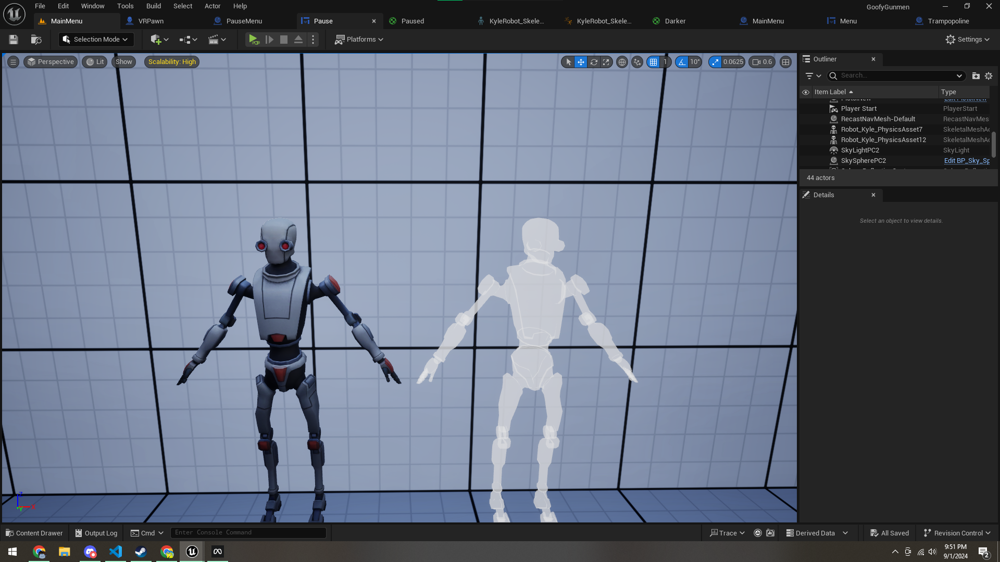

# First and foremost
Welcome to my blog! Did I ever mention I HATE HTML, CSS, and JS?

This blog is REALLY basic right now, I don't even have resolutions working properly... But I wanted to make use of this domain I bought, soooo...

Anywho,

# DEV UPDATE
Me and JabaJava are starting work on Goofy Gunmen again, and it's going pretty well! (considering I had to restart the project) I know how multiplayer with EOS works now, so that's nice :)

^ That is a target! It helps you practice your aim.

and THAT is a trampoline. Pretty self-explanatory...

When your paused in game, unless your fighting, you become invulnerable (until you unpause). You also get this neat material applied that makes you semi-transparent, and you can't move.